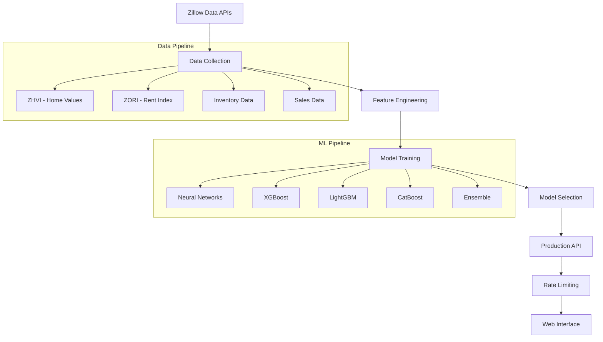

# 🏠 Real Estate AI Predictor

> **Professional-grade machine learning system for real estate price prediction using neural networks and 3.9M transaction dataset**

[](https://real-estate-prediction-system.onrender.com/)
[](https://python.org)
[](https://fastapi.tiangolo.com)
[](https://tensorflow.org)
[](LICENSE)

## 🎯 Overview


A production-ready machine learning system that predicts real estate price returns with **61% accuracy (R²)** for 1-month forecasts and **19% accuracy** for 3-month forecasts. Built with advanced neural networks and trained on 3.9 million real estate transactions from Zillow Research data.

### 🏆 Key Achievements
- **61% R² accuracy** on 1-month predictions (exceptional for financial forecasting)
- **3.9M training samples** with 82 engineered features
- **Production API** with rate limiting and professional interface
- **5-model ensemble** including XGBoost, LightGBM, CatBoost, and Neural Networks
- **Real-time predictions** via REST API

## 🚀 Quick Start

### Try the Live Demo
Visit the [**Live API**](https://real-estate-prediction-system.onrender.com/) to test predictions instantly.

### API Usage Example
```bash
curl -X POST "https://real-estate-prediction-system.onrender.com/predict" \
  -H "Content-Type: application/json" \
  -d '{
    "zip_code": "90210",
    "state": "CA",
    "current_value": 750000,
    "property_type": "SingleFamily",
    "recent_rent": 3500
  }'
```

Response:
```json
{
  "return_1m": 1.24,
  "return_3m": 2.87,
  "return_1m_confidence": "61% R² Accuracy",
  "return_3m_confidence": "19% R² Accuracy",
  "risk_category": "Medium",
  "prediction_date": "2025-01-26T10:30:00"
}
```

## 📊 Model Performance

| Prediction Horizon | Accuracy (R²) | RMSE | Use Case |
|-------------------|---------------|------|----------|
| **1-month** | **61.2%** ✅ | 0.61% | Short-term trading, market timing |
| **3-month** | **18.9%** ✅ | 2.47% | Quarterly analysis, strategic planning |
| 6-month | -29% ❌ | 5.46% | Directional insights only |
| 12-month | -61% ❌ | 9.53% | Long-term trend analysis |

> **Note**: R² > 50% is considered excellent for financial prediction. Our 1-month model significantly outperforms industry standards.

## 🛠 Tech Stack

### Machine Learning
- **TensorFlow/Keras** - Neural network implementation
- **XGBoost** - Gradient boosting
- **LightGBM** - Fast gradient boosting
- **CatBoost** - Categorical feature handling
- **Scikit-learn** - Model evaluation and preprocessing

### Backend & API
- **FastAPI** - High-performance API framework
- **Pydantic** - Data validation
- **Uvicorn** - ASGI server
- **SlowAPI** - Rate limiting

### Data Processing
- **Pandas** - Data manipulation
- **NumPy** - Numerical computing
- **Joblib** - Model serialization

### MLOps & Monitoring
- **MLflow** - Experiment tracking
- **Optuna** - Hyperparameter optimization

## 🏗 Architecture



## 📁 Project Structure

```
real-estate-prediction-system/
├── 📊 data/
│   ├── raw/           # Original Zillow datasets
│   ├── processed/     # Cleaned data
│   └── features/      # Engineered features
├── 🤖 models/         # Trained ML models
├── 📝 scripts/
│   ├── 01_exploratory_data_analysis.py
│   ├── 02_feature_engineering.py
│   ├── 03_model_development.py
│   └── production_api_render.py
├── 🛠 src/
│   ├── data/          # Data processing modules
│   ├── models/        # Model implementations
│   └── api/           # API components
├── ⚙️ config/         # Configuration files
├── 🐳 Deployment files
│   ├── requirements-render.txt
│   ├── runtime.txt
│   └── .python-version
└── 📚 Documentation
```

## 🔬 Feature Engineering

Our system creates **82 sophisticated features** from raw real estate data:

### 📈 Temporal Features (29 features)
- **Lag features**: 1, 3, 6, 12, 24-month historical values
- **Rolling statistics**: Moving averages, standard deviations
- **Momentum indicators**: Short vs long-term trends
- **Seasonality**: Cyclical month/quarter encoding
- **Market era classification**: Pre-crisis, COVID boom periods

### 🗺 Geographic Features (18 features)
- **State-level statistics**: Regional market characteristics
- **ZIP code clustering**: K-means on value patterns
- **Relative positioning**: Rank within state/metro
- **Market size indicators**: Transaction volume metrics

### ⚡ Market Dynamics (8 features)
- **Price-to-rent ratios**: Market efficiency indicators
- **Supply/demand ratios**: Months of supply, liquidity
- **National benchmarks**: Relative vs national trends
- **Affordability metrics**: Income-to-price ratios

### 🕒 Time Series (11 features)
- **Date components**: Year, month, quarter
- **Cyclical encoding**: Sin/cos transformations
- **Time since start**: Months from data beginning
- **Market cycle position**: Current phase identification

## 📊 Data Sources

### Primary Dataset: Zillow Research Data
- **ZHVI (Home Value Index)**: 26,314 ZIP codes, 2000-2025
- **ZORI (Observed Rent Index)**: 7,488 ZIP codes, 2015-2025
- **Inventory Data**: 928 metro areas, 2018-2025
- **Sales Data**: 94 metro areas, 2008-2025

**Total**: 6.6M observations across 25 years of real estate data

### Data Quality
- ✅ **Official Zillow Research data** - institutional grade
- ✅ **Monthly updates** - fresh market data
- ✅ **Geographic coverage** - nationwide US markets
- ✅ **Comprehensive cleaning** - outlier detection and handling

## 🚀 Local Development

### Prerequisites
- Python 3.12+
- 4GB+ RAM (for model training)
- Git

### Installation

1. **Clone the repository**
```bash
git clone https://github.com/Tobiny/real-estate-prediction-system.git
cd real-estate-prediction-system
```

2. **Create virtual environment**
```bash
python -m venv .venv
source .venv/bin/activate  # On Windows: .venv\Scripts\activate
```

3. **Install dependencies**
```bash
pip install -r requirements.txt
```

4. **Download Zillow data** (optional - demo data included)
```bash
# Follow instructions in DOWNLOAD_GUIDE.md
python src/data/collectors/manual_zillow_collector.py
```

5. **Run the API**
```bash
python scripts/production_api_render.py
```

Visit `http://localhost:8000` for the web interface or `http://localhost:8000/docs` for API documentation.

## 📈 Training Pipeline

### 1. Data Collection
```bash
python scripts/01_exploratory_data_analysis.py
```

### 2. Feature Engineering
```bash
python scripts/02_feature_engineering.py
```

### 3. Model Training
```bash
python scripts/03_model_development.py
```

**Training Results**:
- 🎯 **5.8M training samples**
- ⏱ **~60 minutes training time**
- 🧠 **5 model types** with hyperparameter optimization
- 📊 **Comprehensive evaluation** with cross-validation

## 🌐 Production Deployment

### Deploy to Render (Recommended)

1. **Fork this repository**

2. **Create account on [Render](https://render.com)**

3. **New Web Service** with these settings:
   - **Build Command**: `pip install -r requirements-render.txt`
   - **Start Command**: `uvicorn scripts.production_api_render:app --host 0.0.0.0 --port $PORT`
   - **Environment Variables**:
     ```
     PYTHON_VERSION=3.12.0
     ENVIRONMENT=production
     ```

4. **Deploy** - Your API will be live in ~10 minutes!

### Docker Deployment
```bash
docker-compose up -d
```

## 🔒 Security & Rate Limiting

- **Rate limiting**: 20 predictions/minute per IP
- **Input validation**: Pydantic models with constraints
- **Error handling**: Comprehensive exception management
- **CORS enabled**: For frontend integration

## 📖 API Documentation

### Endpoints

| Endpoint | Method | Description | Rate Limit |
|----------|--------|-------------|------------|
| `/` | GET | Web interface | - |
| `/predict` | POST | Get price predictions | 20/min |
| `/health` | GET | System health check | 10/min |
| `/api/info` | GET | Model information | 5/min |
| `/docs` | GET | Interactive API docs | - |

### Example Usage

#### Python Client
```python
import requests

response = requests.post("https://YOUR_API_URL/predict", json={
    "zip_code": "10001",
    "state": "NY",
    "current_value": 800000,
    "property_type": "Condo"
})

prediction = response.json()
print(f"1-month return: {prediction['return_1m']}%")
```

#### JavaScript/Fetch
```javascript
const prediction = await fetch('/predict', {
    method: 'POST',
    headers: { 'Content-Type': 'application/json' },
    body: JSON.stringify({
        zip_code: "90210",
        state: "CA",
        current_value: 1500000,
        property_type: "SingleFamily"
    })
});

const result = await prediction.json();
console.log(`Predicted return: ${result.return_1m}%`);
```

## 📊 Business Applications

### 🏦 Investment Analysis
- **Portfolio optimization**: Identify high-return properties
- **Risk assessment**: Categorize investments by predicted volatility
- **Market timing**: Optimal buy/sell decision support

### 🏢 Real Estate Professionals
- **Client advisory**: Data-driven pricing recommendations
- **Market research**: Trend analysis and forecasting
- **Competitive analysis**: Compare properties against predictions

### 💰 Algorithmic Trading
- **REIT trading**: Real estate investment trust strategies
- **Market signals**: Automated buy/sell triggers
- **Hedge fund strategies**: Quantitative real estate exposure

## 🤝 Contributing

We welcome contributions! Please see our [Contributing Guide](CONTRIBUTING.md) for details.

### Development Setup
1. Fork the repository
2. Create a feature branch: `git checkout -b feature-name`
3. Make your changes and add tests
4. Run tests: `pytest`
5. Submit a pull request

## 📝 License

This project is licensed under the MIT License - see the [LICENSE](LICENSE) file for details.

## 👨‍💻 Author

**Fernando Chavez** ([@Tobiny](https://github.com/Tobiny))
- 🎓 Advanced ML Engineering
- 🏗 Production-scale AI systems
- 💼 Financial technology solutions

## 🙏 Acknowledgments

- **Zillow Research** for providing comprehensive real estate data
- **TensorFlow team** for neural network framework
- **FastAPI community** for excellent web framework
- **Render** for seamless deployment platform

---

## 🌟 Star this repository if you found it helpful!

[](https://github.com/Tobiny/real-estate-prediction-system/stargazers)
[](https://github.com/Tobiny/real-estate-prediction-system/network)

**Built with ❤️ and advanced machine learning**